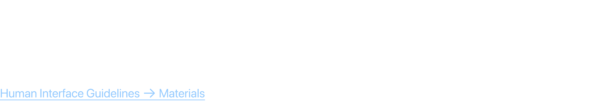
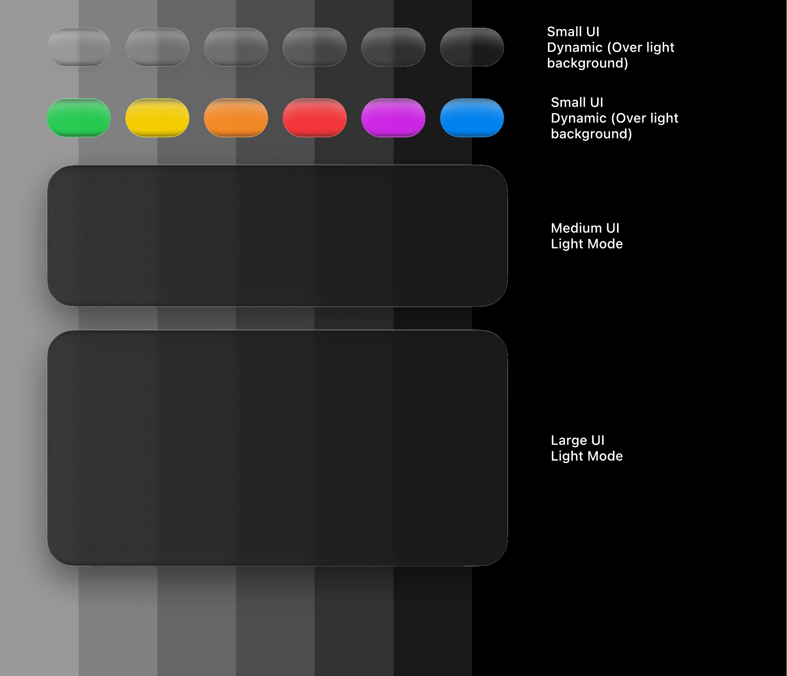
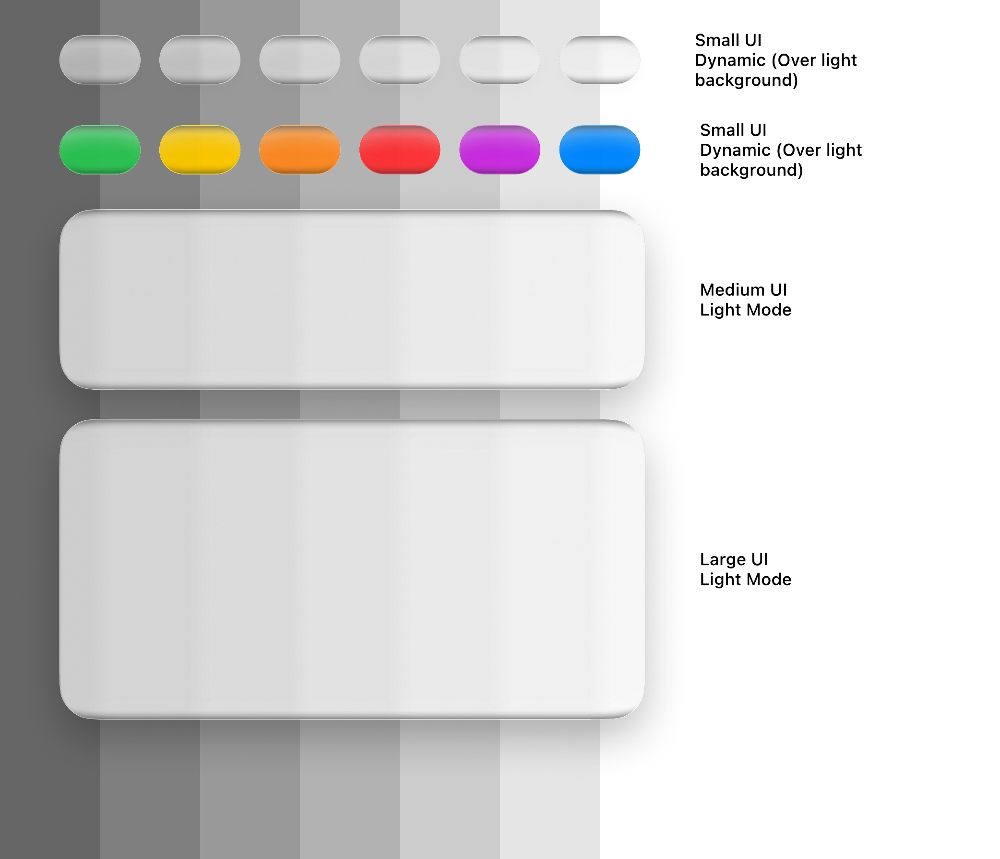
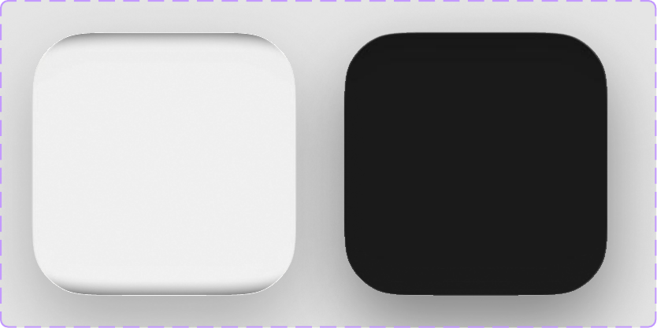
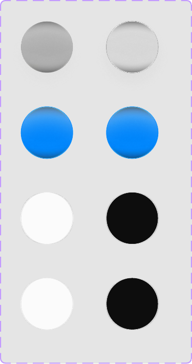
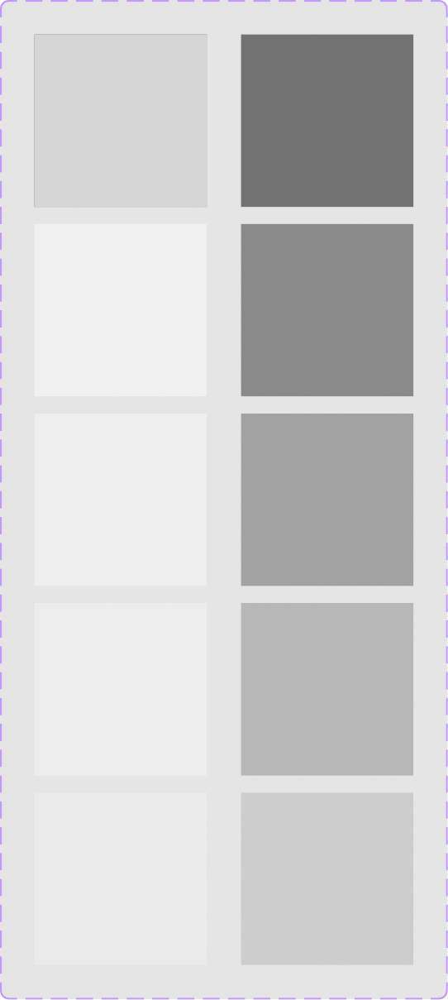
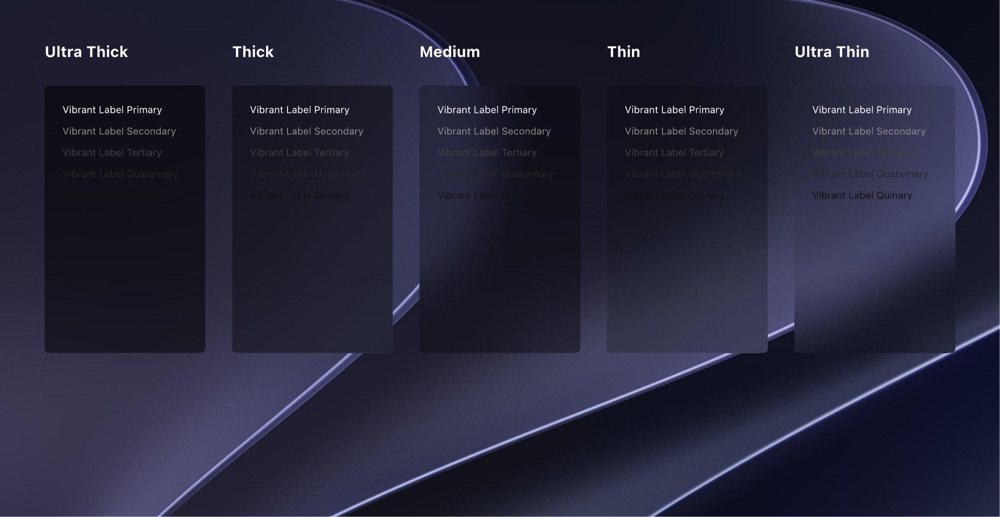
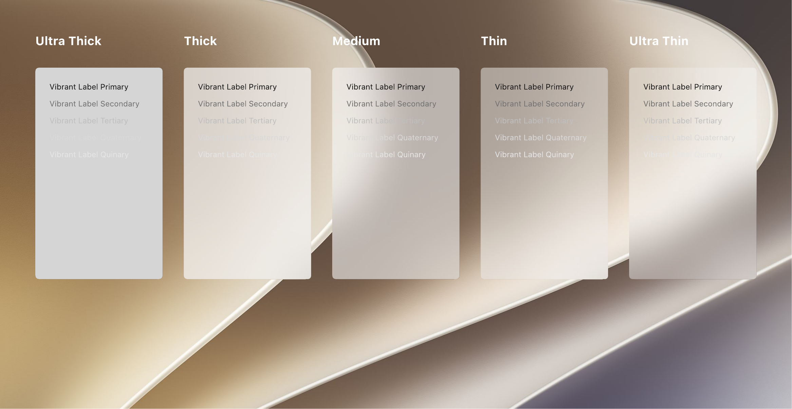
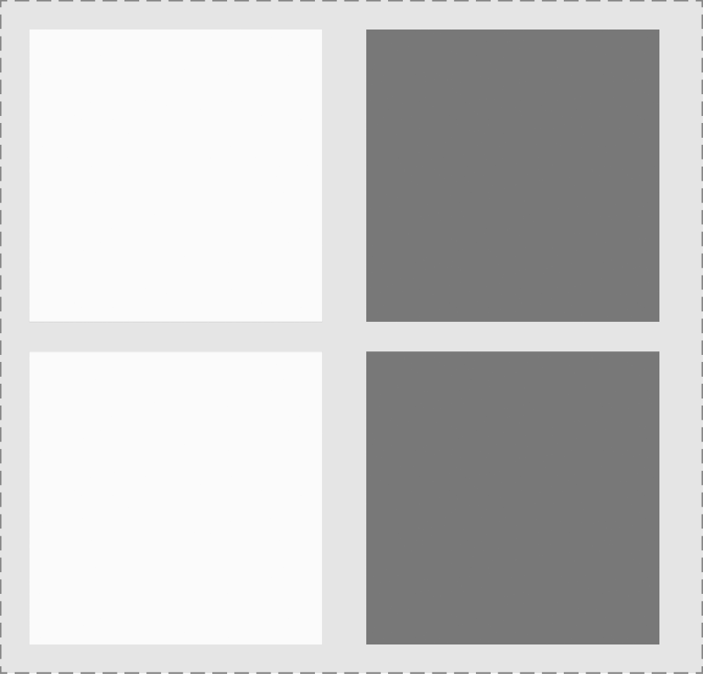
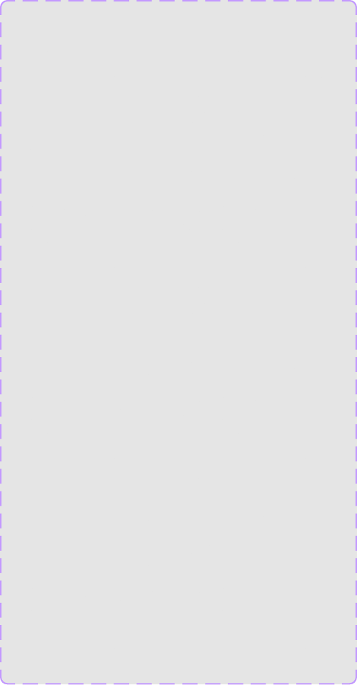

# Liquid Glass & Materials

Materials create a sense of depth, layering, and hierarchy in macOS interfaces by mimicking physical materials like glass. They allow background colors and content to show through translucent layers.

## Official Apple HIG Guidelines & Resources

- [Materials](https://developer.apple.com/design/human-interface-guidelines/materials)

## Key Design Rules & Constraints

- Use materials to indicate active states, layers, and visual hierarchy.
- Avoid solid opaque backgrounds where translucency helps maintain context.
- Choose materials carefully based on screen placement (e.g., Ultra Thin for overlays, Thick for sidebars/panels).
- Ensure text contrast remains high when vibrant label colors are layered over translucent glass.

## Figma Component Specifications

These specifications are extracted from the local design PDFs inside this folder:

### Header.pdf

**Labels and Text elements:**

- `M a t e r i a l s`
- `A mat erial is a visual eff ect that cr eat es a sense of depth,  lay ering,  and hier ar chy between f or egr ound and back gr ound`
- `elements.`
- `Human Int erf ace Guidelines 􀄫 M at erials`

### Liquid Glass - Dark.pdf

**Labels and Text elements:**

- `Small UI`
- `Dynamic (Ov er light`
- `back gr ound)`
- `Small UI`
- `Dynamic (Ov er light`
- `back gr ound)`
- `Medium UI`
- `Light Mode`
- `Lar ge UI`
- `Light Mode`

### Liquid Glass - Large.pdf

*No text labels extracted (primarily visual design layout/spec).*

### Liquid Glass - Light.pdf

**Labels and Text elements:**

- `Small UI`
- `Dynamic (Ov er light`
- `back gr ound)`
- `Small UI`
- `Dynamic (Ov er light`
- `back gr ound)`
- `Medium UI`
- `Light Mode`
- `Lar ge UI`
- `Light Mode`

### Liquid Glass - Medium.pdf

*No text labels extracted (primarily visual design layout/spec).*

### Liquid Glass - Small.pdf

*No text labels extracted (primarily visual design layout/spec).*

### Materials - Dark.pdf

**Labels and Text elements:**

- `Ultr a Thick`
- `Vibrant Label Primar y`
- `Vibrant Label Secondar y`
- `Vibrant Label T er tiar y`
- `Vibrant Label Quat er nar y`
- `Vibrant Label Quinar y`
- `Thick`
- `Vibrant Label Primar y`
- `Vibrant Label Secondar y`
- `Vibrant Label T er tiar y`
- `Vibrant Label Quat er nar y`
- `Vibrant Label Quinar y`
- `Medium`
- `Vibrant Label Primar y`
- `Vibrant Label Secondar y`
- *...and 15 more text elements.*

### Materials - Light.pdf

**Labels and Text elements:**

- `Ultr a Thick`
- `Vibrant Label Primar y`
- `Vibrant Label Secondar y`
- `Vibrant Label T er tiar y`
- `Vibrant Label Quat er nar y`
- `Vibrant Label Quinar y`
- `Thick`
- `Vibrant Label Primar y`
- `Vibrant Label Secondar y`
- `Vibrant Label T er tiar y`
- `Vibrant Label Quat er nar y`
- `Vibrant Label Quinar y`
- `Medium`
- `Vibrant Label Primar y`
- `Vibrant Label Secondar y`
- *...and 15 more text elements.*

### Materials.pdf

*No text labels extracted (primarily visual design layout/spec).*

### Scroll Edge Effect - Hard.pdf

*No text labels extracted (primarily visual design layout/spec).*

### Scroll Edge Effect - Soft.pdf

*No text labels extracted (primarily visual design layout/spec).*

## Visual Design Gallery (Screenshots)

Below are the rendered pages from the design component PDFs:

### Header 1

### Liquid Glass   Dark 1

### Liquid Glass   Large 1

### Liquid Glass   Light 1

### Liquid Glass   Medium 1

### Liquid Glass   Small 1

### Materials 1

### Materials   Dark 1

### Materials   Light 1

### Scroll Edge Effect   Hard 1

### Scroll Edge Effect   Soft 1

