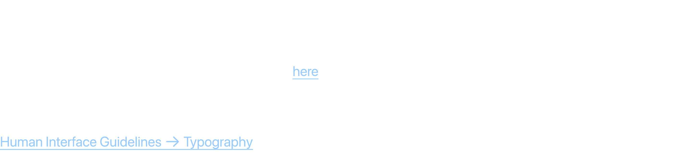
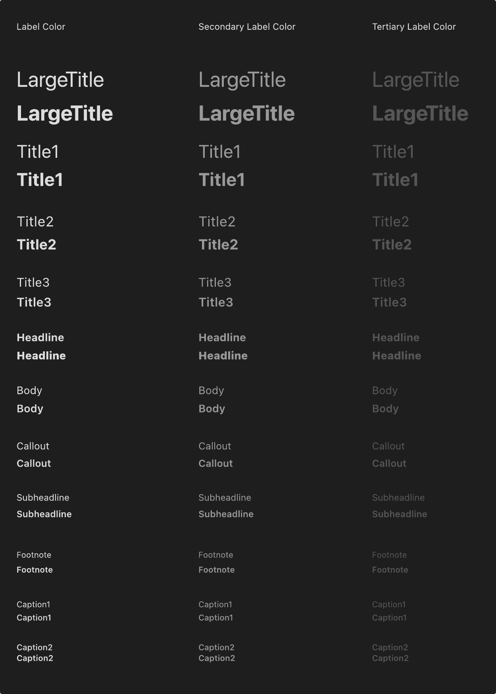
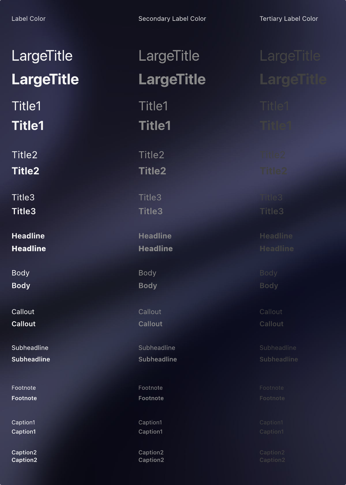
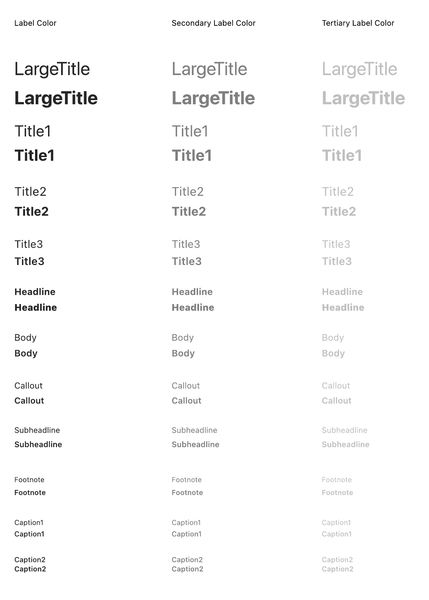
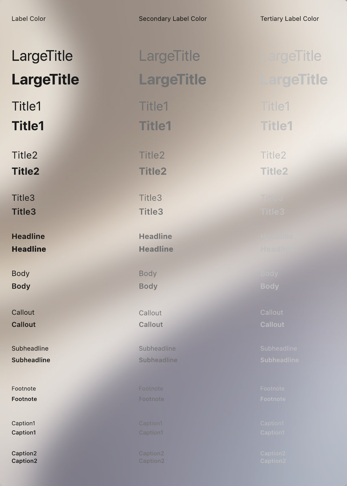

# Typography & Text Styles

macOS typography uses the San Francisco (SF Pro) and New York system fonts. It supports a wide range of weights, sizes, and styles that automatically adjust for optimal readability.

## Official Apple HIG Guidelines & Resources

- [Typography](https://developer.apple.com/design/human-interface-guidelines/typography)
- 

## Key Design Rules & Constraints

- Use system-defined text styles (e.g., Large Title, Headline, Body, Callout) to ensure consistency and support Dynamic Type scaling.
- Maintain proper hierarchy by using bold or semibold weights for headings and regular/light weights for body copy.
- Ensure proper text alignment (typically left-aligned for Western languages) and line spacing for readability.
- Ensure color styling uses primary, secondary, and tertiary label colors for visual hierarchy.

## Figma Component Specifications

These specifications are extracted from the local design PDFs inside this folder:

### Header.pdf

**Labels and Text elements:**

- `T y p o g r a p h y`
- `Apple pr o vides two typef ace f amilies that suppor t an e xt ensiv e r ange of weights,  siz es,  styles,  and languages: San`
- `Fr ancisco and New Y ork,  which y ou can download her e .  The syst em defines a set of typogr aphic attribut es — called t e xt`
- `styles — that work with both typef ace f amilies. Dynamic T ype is a syst em-le v el f eatur e that lets people adjust the siz e of`
- `visible t e xt on their de vice t o ensur e r eadability and comf or t.`
- `Human Int erf ace Guidelines  􀄫 T ypogr aphy`

### Text Styles - Left Aligned - Dark Opaque.pdf

**Labels and Text elements:**

- `Label Color`
- `Lar ge T itle`
- `Lar ge T itle`
- `T itle 1`
- `T itle 1`
- `T itle2`
- `Tit le2`
- `T itle3`
- `T itle3`
- `Headline`
- `Headline`
- `Body`
- `Body`
- `Callout`
- `Callout`
- *...and 54 more text elements.*

### Text Styles - Left Aligned - Dark Vibrant.pdf

**Labels and Text elements:**

- `Label Color`
- `Lar ge T itle`
- `Lar ge T itle`
- `T itle 1`
- `T itle 1`
- `T itle2`
- `Tit le2`
- `T itle3`
- `T itle3`
- `Headline`
- `Headline`
- `Body`
- `Body`
- `Callout`
- `Callout`
- *...and 54 more text elements.*

### Text Styles - Left Aligned - Light Opaque.pdf

**Labels and Text elements:**

- `Label Color`
- `Lar ge T itle`
- `Lar ge T itle`
- `T itle 1`
- `T itle 1`
- `T itle2`
- `Tit le2`
- `T itle3`
- `T itle3`
- `Headline`
- `Headline`
- `Body`
- `Body`
- `Callout`
- `Callout`
- *...and 54 more text elements.*

### Text Styles - Left Aligned - Light Vibrant.pdf

**Labels and Text elements:**

- `Label Color`
- `Lar ge T itle`
- `Lar ge T itle`
- `T itle 1`
- `T itle 1`
- `T itle2`
- `Tit le2`
- `T itle3`
- `T itle3`
- `Headline`
- `Headline`
- `Body`
- `Body`
- `Callout`
- `Callout`
- *...and 54 more text elements.*

## Visual Design Gallery (Screenshots)

Below are the rendered pages from the design component PDFs:

### Header 1

### Text Styles   Left Aligned   Dark Opaque 1

### Text Styles   Left Aligned   Dark Vibrant 1

### Text Styles   Left Aligned   Light Opaque 1

### Text Styles   Left Aligned   Light Vibrant 1

