# Toggles, Checkboxes & Radio Buttons

Toggles, checkboxes, and radio buttons allow users to choose between binary states or make selections from multiple mutually exclusive options.

## Official Apple HIG Guidelines & Resources

- [Toggles](https://developer.apple.com/design/human-interface-guidelines/toggles)

## Key Design Rules & Constraints

- Use switches/toggles for immediate state changes (e.g., turning a feature on/off in settings).
- Use checkboxes for choosing one or more items in a list, or for binary settings that require an explicit save/apply action.
- Use radio buttons for choosing a single option from a small, mutually exclusive set of 2-5 items.
- Ensure toggle and radio glyphs use system-standard sizes and clear active/inactive visual indicators.

## Figma Component Specifications

These specifications are extracted from the local design PDFs inside this folder:

### Dark Examples-1.pdf

**Labels and Text elements:**

- `Label Label Label`
- `Label Label Label`
- `Label Label Label`
- `Label Label Label`
- `Label Label Label`
- `Label Label Label`
- `Label`
- `Label`
- `Label`
- `Label`
- `Label`
- `Label`
- `Label`
- `Label`
- `Label`
- *...and 70 more text elements.*

### Dark Examples-2.pdf

**Labels and Text elements:**

- `Label Label Label`
- `Label Label Label`
- `Label Label Label`
- `Label Label Label`
- `Label Label Label`
- `Label Label Label`
- `Label`
- `Label`
- `Label`
- `Label`
- `Label`
- `Label`
- `Label`
- `Label`
- `Label`
- *...and 70 more text elements.*

### Dark Examples.pdf

**Labels and Text elements:**

- `Dark Examples`

### Header.pdf

**Labels and Text elements:**

- `T o g g l e s`
- `A t oggle lets people choose between a pair of opposing st at es,  lik e on and off ,  using a diff er ent appear ance t o indicat e`
- `each st at e.`
- `Human Int erf ace Guidelines  􀄫 T oggles`

### Light Examples-1.pdf

**Labels and Text elements:**

- `Label Label Label`
- `Label Label Label`
- `Label Label Label`
- `Label Label Label`
- `Label Label Label`
- `Label Label Label`
- `Label`
- `Label`
- `Label`
- `Label`
- `Label`
- `Label`
- `Label`
- `Label`
- `Label`
- *...and 70 more text elements.*

### Light Examples-2.pdf

**Labels and Text elements:**

- `Label Label Label`
- `Label Label Label`
- `Label Label Label`
- `Label Label Label`
- `Label Label Label`
- `Label Label Label`
- `Light Examples`
- `Label`
- `Label`
- `Label`
- `Label`
- `Label`
- `Label`
- `Label`
- `Label`
- *...and 70 more text elements.*

### Light Examples.pdf

**Labels and Text elements:**

- `Light Examples`

### Toggles - Checkboxes.pdf

**Labels and Text elements:**

- `Label Label Label`
- `Label Label Label`
- `Label Label Label`
- `Label Label Label`
- `Label Label Label`
- `Label Label Label`

### Toggles - Radio Buttons.pdf

**Labels and Text elements:**

- `Label Label Label`
- `Label Label Label`
- `Label Label Label`
- `Label Label Label`
- `Label Label Label`
- `Label Label Label`

### Toggles - Switches.pdf

*No text labels extracted (primarily visual design layout/spec).*

### _Glyphs - Checkboxes.pdf

*No text labels extracted (primarily visual design layout/spec).*

### _Glyphs - Radio Buttons.pdf

*No text labels extracted (primarily visual design layout/spec).*

### _Knob Clicked.pdf

*No text labels extracted (primarily visual design layout/spec).*

### _Knob.pdf

*No text labels extracted (primarily visual design layout/spec).*

## Visual Design Gallery (Screenshots)

Below are the rendered pages from the design component PDFs:

### Dark Examples 1 1

### Dark Examples 1
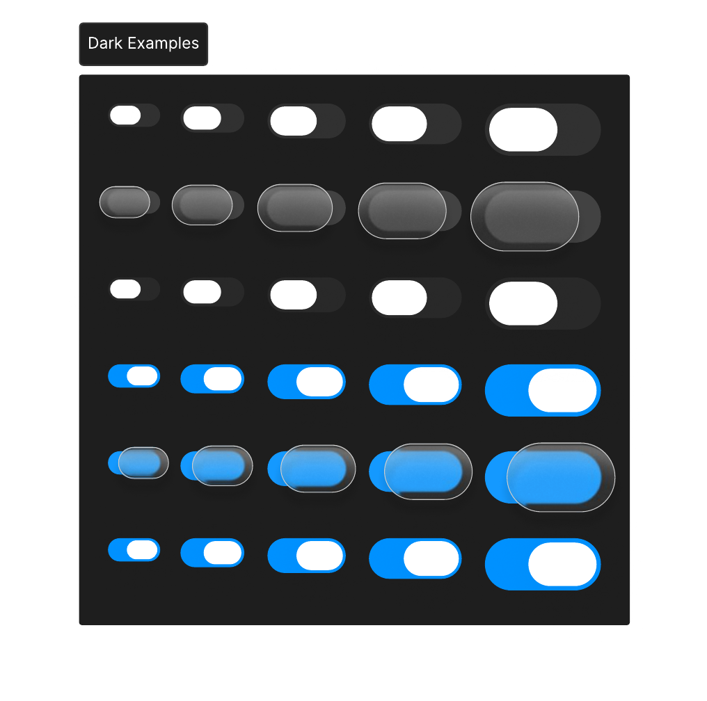

### Dark Examples 2 1
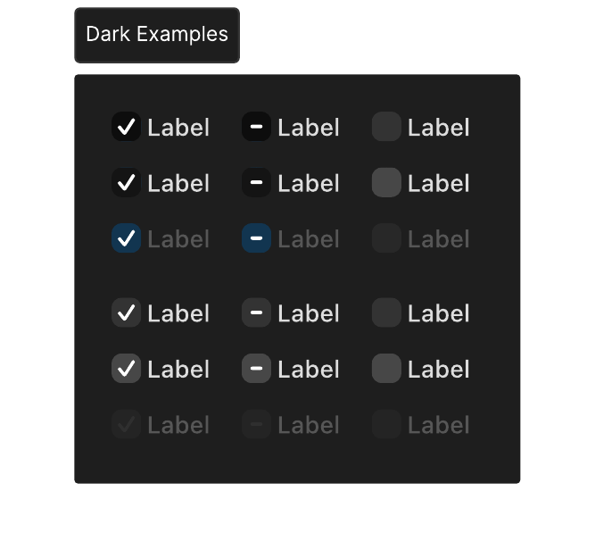

### Header 1
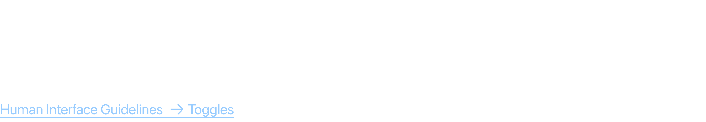

### Light Examples 1 1
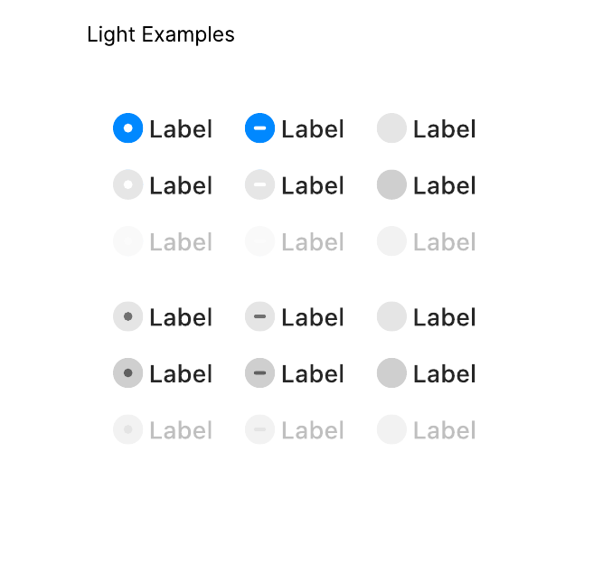

### Light Examples 1
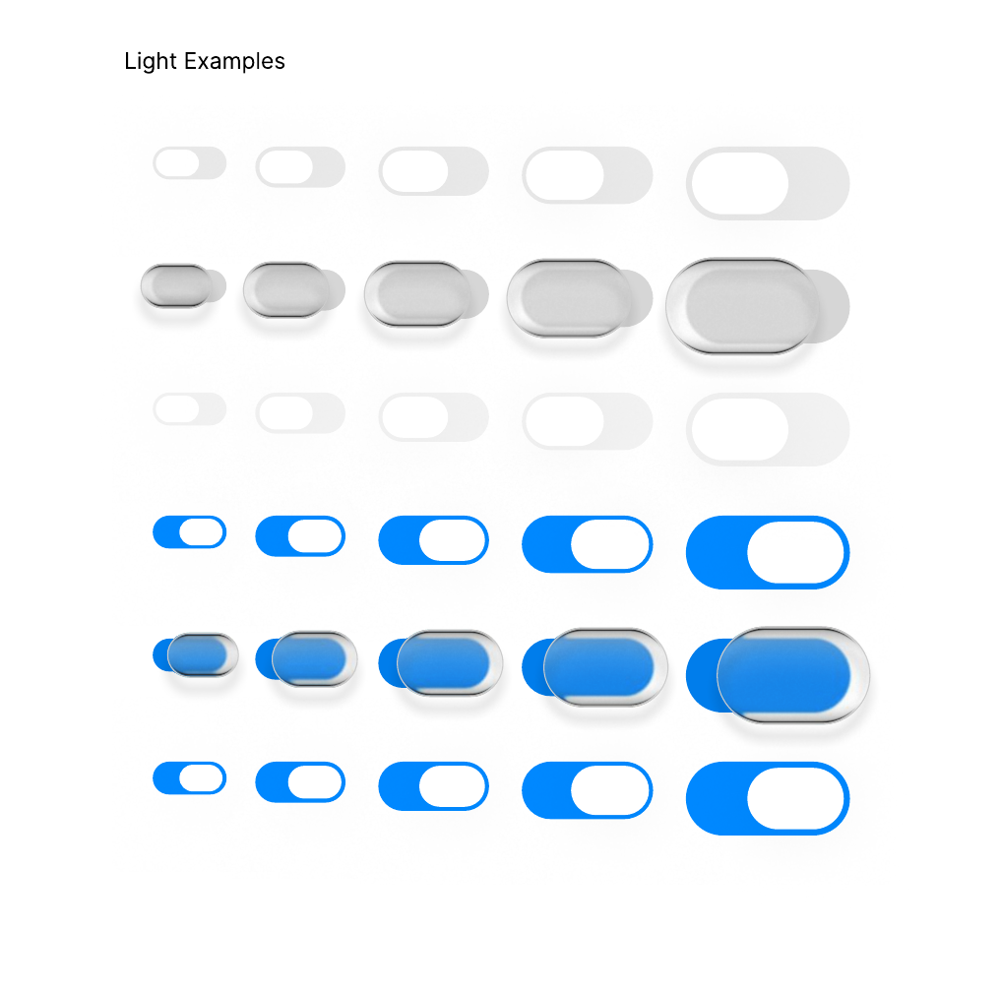

### Light Examples 2 1
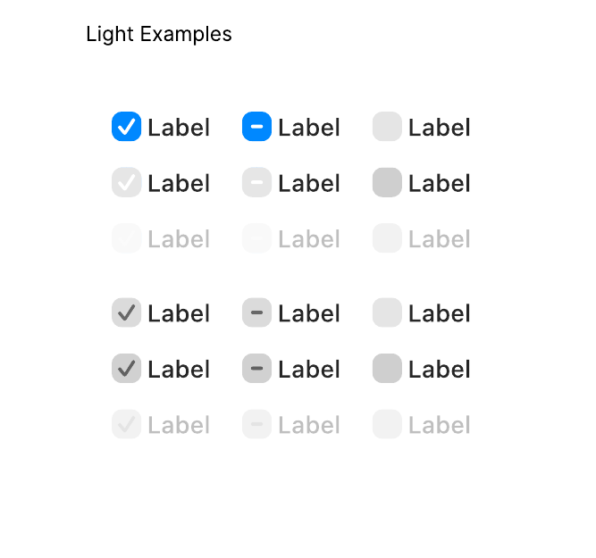

### Toggles   Checkboxes 1
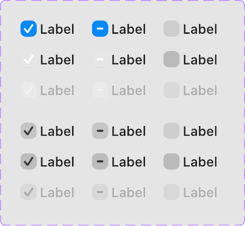

### Toggles   Radio Buttons 1
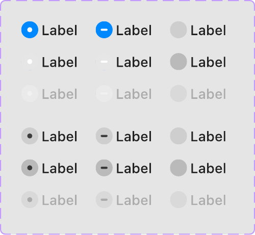

### Toggles   Switches 1
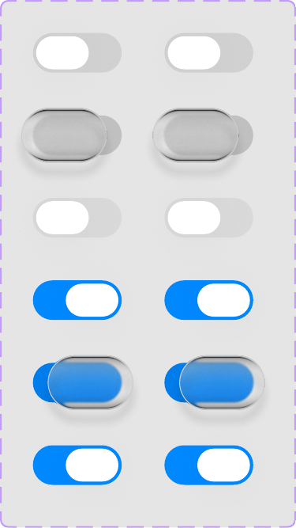

###  Glyphs   Checkboxes 1
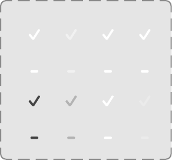

###  Glyphs   Radio Buttons 1
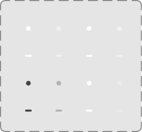

###  Knob 1
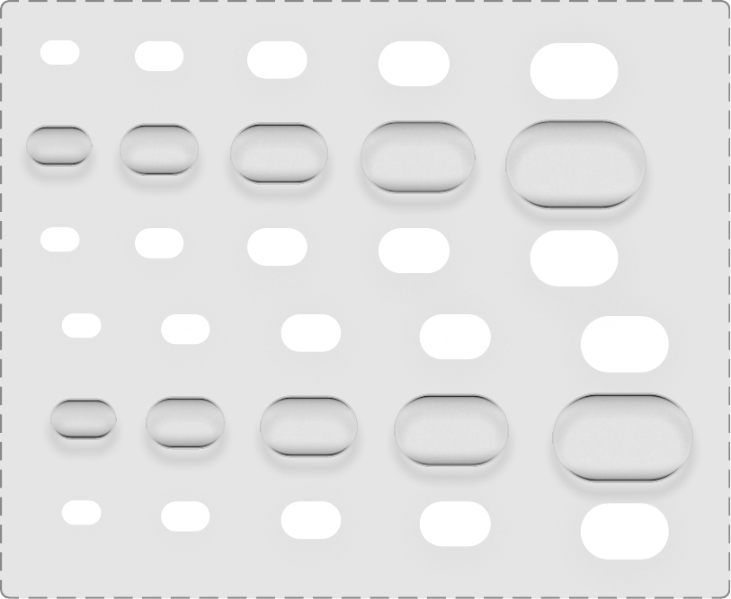

###  Knob Clicked 1
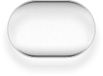
