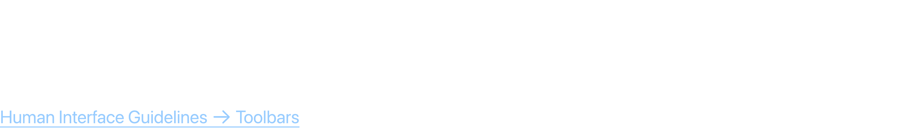
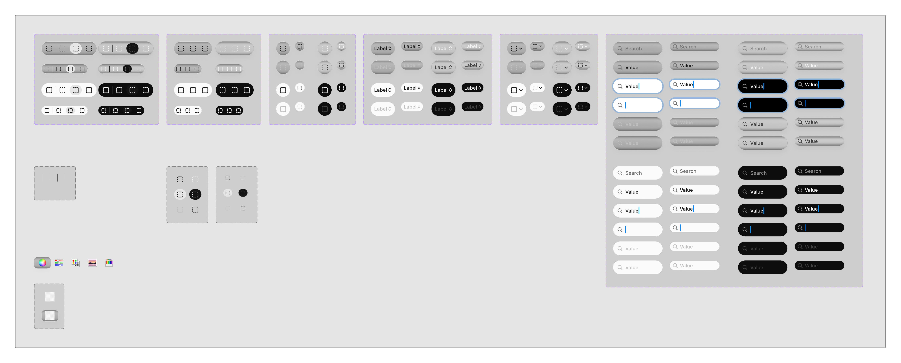

# Toolbars

Toolbars appear at the top of app windows and provide quick access to frequently used commands, controls, and navigation items.

## Official Apple HIG Guidelines & Resources

- [Toolbars](https://developer.apple.com/design/human-interface-guidelines/toolbars)

## Key Design Rules & Constraints

- Keep toolbars uncluttered by only including the most common operations.
- Group related controls logically and use flexible spacing to separate groups.
- Support toolbar customization so users can add, remove, or rearrange items.
- Provide tooltips or icon labels to help users identify control functions.

## Figma Component Specifications

These specifications are extracted from the local design PDFs inside this folder:

### Header.pdf

**Labels and Text elements:**

- `T o o l b a r s`
- `A t oolbar pr o vides conv enient access t o fr equently used commands,  contr ols,  navigation,  and sear ch.`
- `Human Int erf ace Guidelines 􀄫 T oolbars`

### Untitled.pdf

**Labels and Text elements:**

- `􀓔`
- `􀓔`
- `􀓔`
- `􀓔`
- `􀓔`
- `􀓔`
- `􀓔`
- `􀓔`
- `􀓔`
- `􀓔 􀓔`
- `􀓔`
- `􀓔 􀓔`
- `􀓔`
- `􀓔`
- `􀓔`
- *...and 135 more text elements.*

## Visual Design Gallery (Screenshots)

Below are the rendered pages from the design component PDFs:

### Header 1

### Untitled 1

