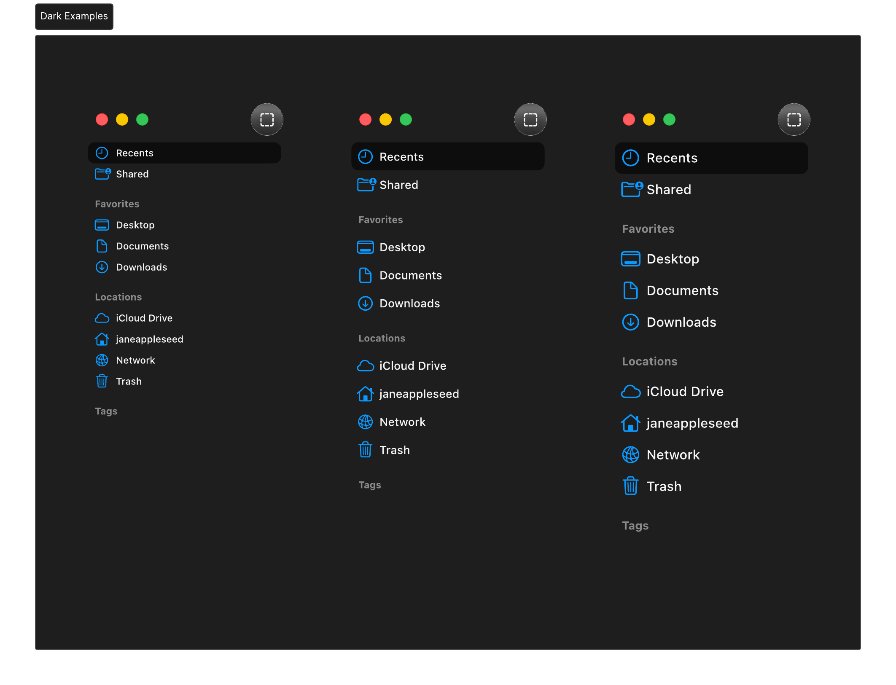
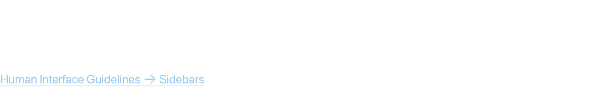
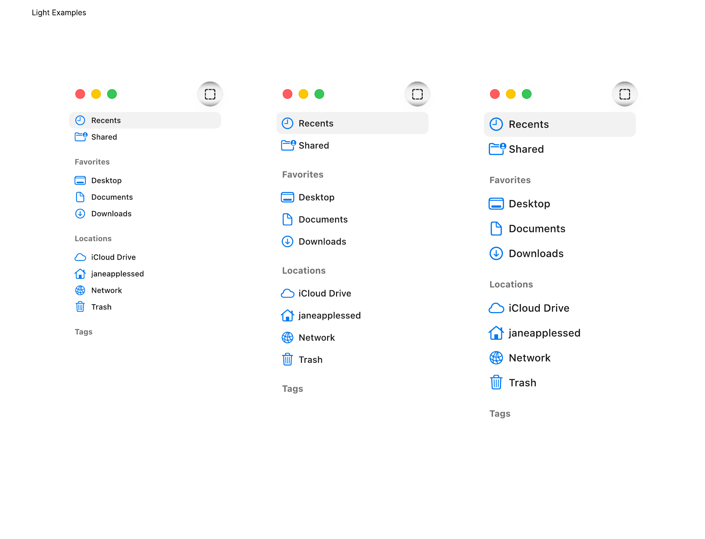
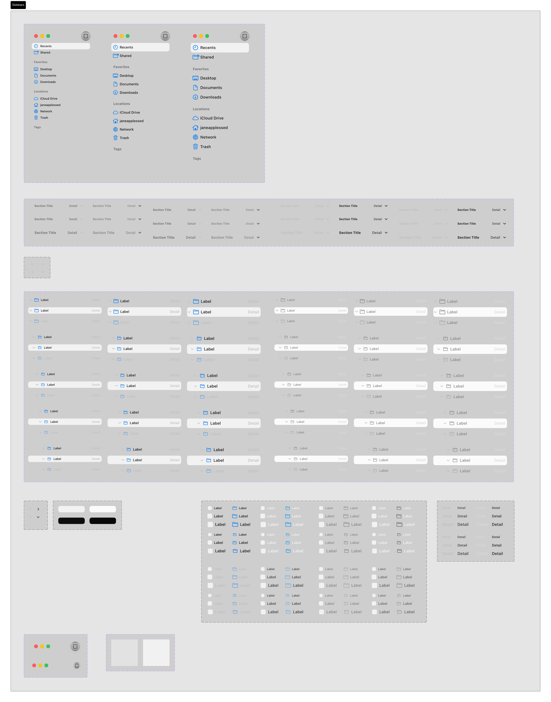

# Sidebars

Sidebars provide app-level navigation, list collections, or filter views, appearing vertically on either side of the main content area (usually the left).

## Official Apple HIG Guidelines & Resources

- [Sidebars](https://developer.apple.com/design/human-interface-guidelines/sidebars)

## Key Design Rules & Constraints

- Use a translucent sidebar material (such as macOS sidebar material) to give a light, airy feel.
- Organize sidebar items into clear headers and lists (e.g., Favorites, Library).
- Allow users to collapse or resize the sidebar to customize their workspace.
- Ensure selected/active sidebar items use the system accent color for clear feedback.

## Figma Component Specifications

These specifications are extracted from the local design PDFs inside this folder:

### Dark Examples.pdf

**Labels and Text elements:**

- `􀓔`
- `􀐫 R ecent s`
- `􀈝 Shar ed`
- `F a v orit es`
- `􀣰 Desk t op`
- `􀈷 Document s`
- `􀁸 Do wnloads`
- `L ocations`
- `􀇂 iCloud Driv e`
- `􀎞 janeapples sed`
- `􀤆 Netw ork`
- `􀈑 T r ash`
- `T ags`
- `􀓔`
- `􀐫 R ecent s`
- *...and 380 more text elements.*

### Header.pdf

**Labels and Text elements:**

- `S i d e b a r s`
- `A sidebar appears on the leading side of a view and lets people navigat e between sections in y our app or game.`
- `Human Int erf ace Guidelines 􀄫 Sidebars`

### Light Examples.pdf

**Labels and Text elements:**

- `􀓔`
- `􀐫 R ecent s`
- `􀈝 Shar ed`
- `F a v orit es`
- `􀣰 Desk t op`
- `􀈷 Document s`
- `􀁸 Do wnloads`
- `L ocations`
- `􀇂 iCloud Driv e`
- `􀎞 janeapples sed`
- `􀤆 Netw ork`
- `􀈑 T r ash`
- `T ags`
- `􀓔`
- `􀐫 R ecent s`
- *...and 380 more text elements.*

### Sidebars.pdf

**Labels and Text elements:**

- `Sidebars`
- `􀓔`
- `􀐫 R ecent s`
- `􀈝 Shar ed`
- `F a v orit es`
- `􀣰 Desk t op`
- `􀈷 Document s`
- `􀁸 Do wnloads`
- `L ocations`
- `􀇂 iCloud Driv e`
- `􀎞 janeapples sed`
- `􀤆 Netw ork`
- `􀈑 T r ash`
- `T ags`
- `􀓔`
- *...and 411 more text elements.*

## Visual Design Gallery (Screenshots)

Below are the rendered pages from the design component PDFs:

### Dark Examples 1

### Header 1

### Light Examples 1

### Sidebars 1

