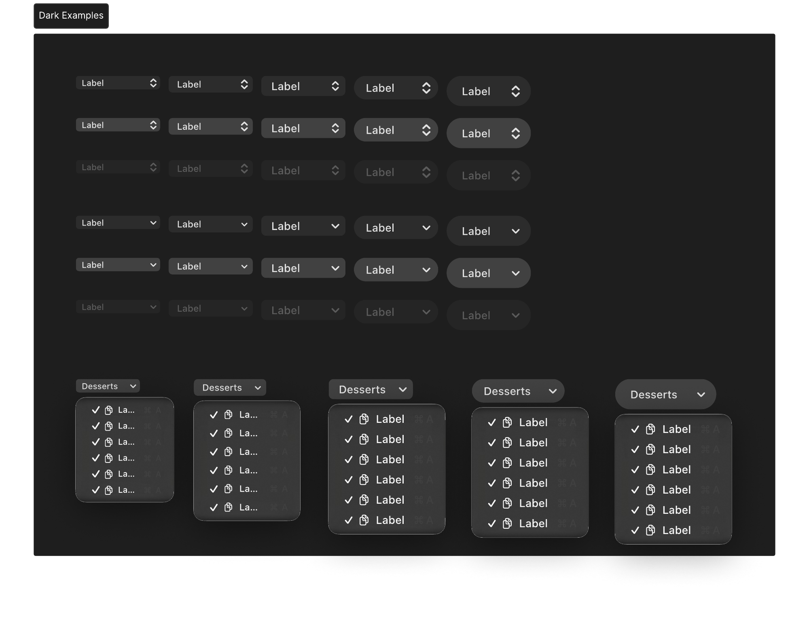
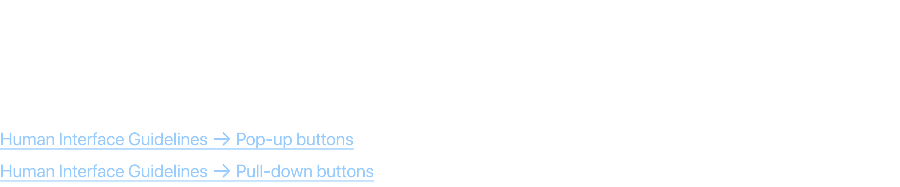
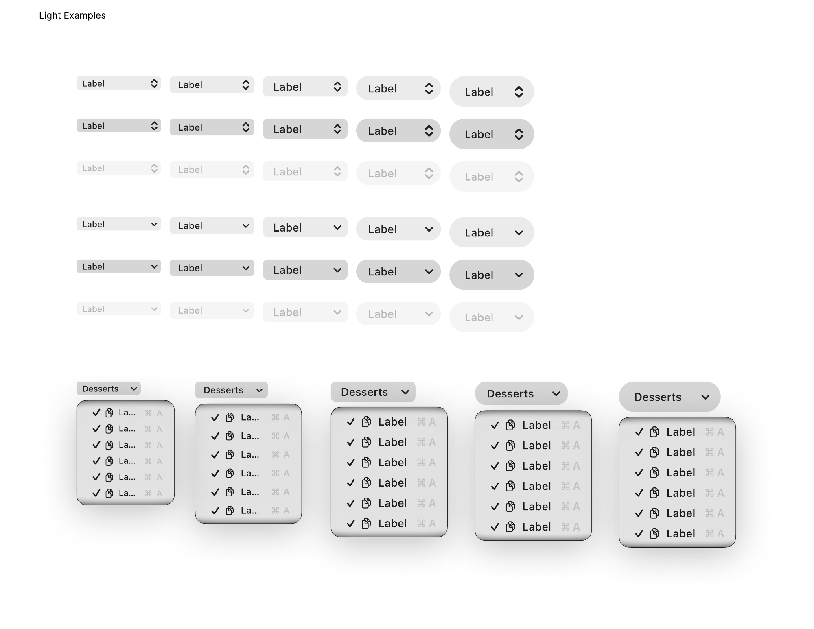
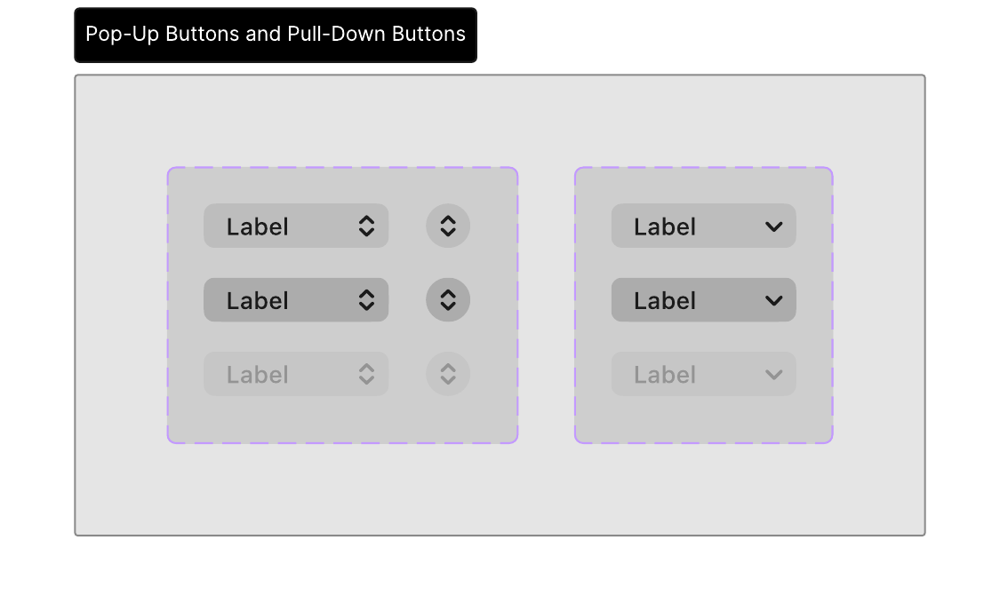

# Pop-Up & Pull-Down Buttons

Pop-up buttons display a list of mutually exclusive choices, where the selected item is shown on the button. Pull-down buttons display a list of actions or commands.

## Official Apple HIG Guidelines & Resources

- [Pop Up Buttons](https://developer.apple.com/design/human-interface-guidelines/pop-up-buttons)
- [Pull Down Buttons](https://developer.apple.com/design/human-interface-guidelines/pull-down-buttons)

## Key Design Rules & Constraints

- Use pop-up buttons to choose from a list of mutually exclusive parameters (e.g., sorting options, file formats).
- Use pull-down buttons to present a menu of actions, state toggles, or secondary settings without changing the button label.
- Keep the menu item list concise, logical, and grouped with separators if necessary.
- Use standard dropdown indicator arrows (double arrow for pop-ups, single down arrow for pull-downs).

## Figma Component Specifications

These specifications are extracted from the local design PDFs inside this folder:

### Dark Examples.pdf

**Labels and Text elements:**

- `Label`
- `Label`
- `Label`
- `􀆏`
- `􀆏`
- `􀆏`
- `􀆏`
- `􀆏`
- `􀆏`
- `Label 􀆈`
- `Label 􀆈`
- `Label 􀆈`
- `Label 􀆏`
- `Label 􀆏`
- `Label 􀆏`
- *...and 262 more text elements.*

### Header.pdf

**Labels and Text elements:**

- `P o p - u p  a n d  p u l l - d o w n  b u t t o n s`
- `A pop-up butt on displays a menu of mutually e x clusiv e options.  A pull-down butt on displays a menu of it ems or actions`
- `that dir ectly r elat e t o the butt on ’ s purpose.`
- `Human Int erf ace Guidelines 􀄫 P op-up butt ons`
- `Human Int erf ace Guidelines 􀄫 Pull-down butt ons`

### Light Examples.pdf

**Labels and Text elements:**

- `Label`
- `Label`
- `Label`
- `􀆏`
- `􀆏`
- `􀆏`
- `􀆏`
- `􀆏`
- `􀆏`
- `Label 􀆈`
- `Label 􀆈`
- `Label 􀆈`
- `Light Examples`
- `Label 􀆏`
- `Label 􀆏`
- *...and 262 more text elements.*

### Pop-Up Buttons and Pull-Down Buttons.pdf

**Labels and Text elements:**

- `Pop-Up Buttons and Pull-Down Buttons`
- `Label`
- `Label`
- `Label`
- `􀆏`
- `􀆏`
- `􀆏`
- `􀆏`
- `􀆏`
- `􀆏`
- `Label 􀆈`
- `Label 􀆈`
- `Label 􀆈`
- `Label 􀆏`
- `Label 􀆏`
- *...and 142 more text elements.*

## Visual Design Gallery (Screenshots)

Below are the rendered pages from the design component PDFs:

### Dark Examples 1

### Header 1

### Light Examples 1

### Pop Up Buttons And Pull Down Buttons 1

