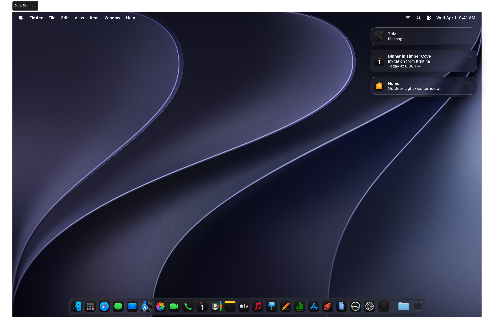
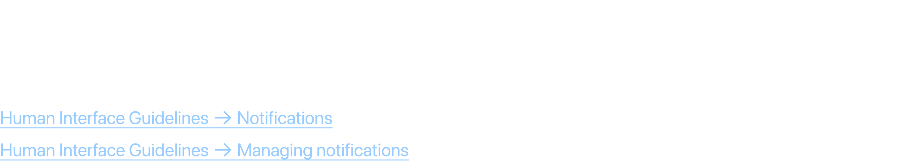
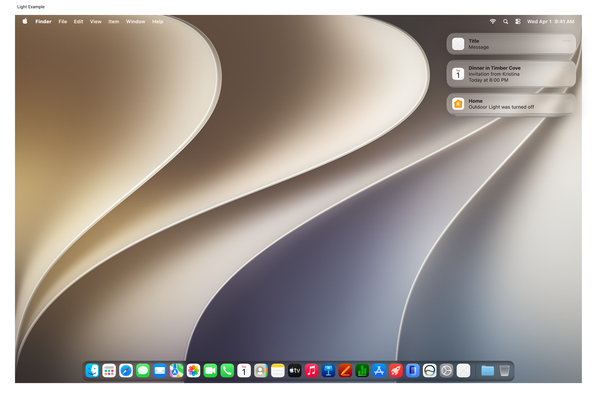
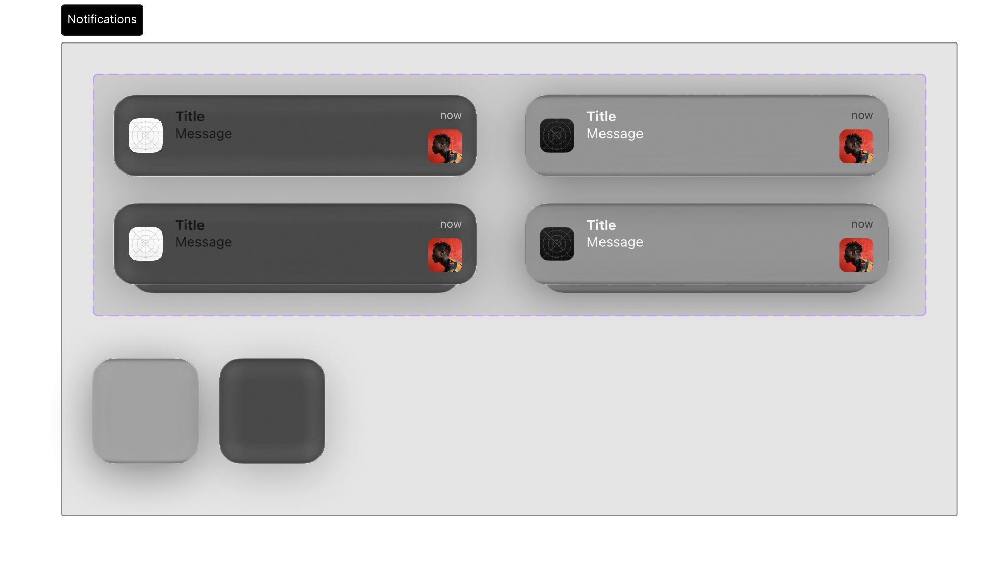

# Notifications

Notifications deliver timely, important information from apps, appearing as banners or alerts that users can interact with.

## Official Apple HIG Guidelines & Resources

- [Notifications](https://developer.apple.com/design/human-interface-guidelines/notifications)
- [Managing Notifications](https://developer.apple.com/design/human-interface-guidelines/managing-notifications)

## Key Design Rules & Constraints

- Only send notifications for time-sensitive, actionable, or highly relevant events.
- **Keep notifications concise**: a short title, a clear body message, and optional action buttons.
- Provide custom action buttons (e.g., Reply, Archive) to let users act without opening the app.
- Respect user preferences regarding notifications, sounds, and badges.

## Figma Component Specifications

These specifications are extracted from the local design PDFs inside this folder:

### Dark Example.pdf

**Labels and Text elements:**

- `􀣺 Finder File Edit Vie w It em Windo w Help 􀊫 W ed Apr 1 9 :4 1 AM`
- `no wT i t l e`
- `M e s s a g e`
- `D i n n e r  i n  T i m b e r  C o v e`
- `I n v i t a t i o n  f r o m  K r i s t i n a`
- `T o d a y  a t  8 : 0 0  P M`
- `no w`
- `H o m e`
- `O u t d o o r  L i g h t  w a s  t u r n e d  o f f`
- `no w`
- `Dark Example`
- `􀣺 Finder File Edit Vie w It em Windo w Help 􀊫 W ed Apr 1 9 :4 1 AM`
- `no wT i t l e`
- `M e s s a g e`
- `D i n n e r  i n  T i m b e r  C o v e`
- *...and 18 more text elements.*

### Header.pdf

**Labels and Text elements:**

- `N o t i f i c a t i o n s`
- `A notification giv es people timely ,  high-v alue inf ormation the y can underst and at a glance.`
- `Human Int erf ace Guidelines 􀄫 Notifications`
- `Human Int er f ace Guidelines 􀄫 M anaging notifications`

### Light Example.pdf

**Labels and Text elements:**

- `Light Example`
- `􀣺 Finder File Edit Vie w It em Windo w Help 􀊫 W ed Apr 1 9 :4 1 AM`
- `no wT i t l e`
- `M e s s a g e`
- `D i n n e r  i n  T i m b e r  C o v e`
- `I n v i t a t i o n  f r o m  K r i s t i n a`
- `T o d a y  a t  8 : 0 0  P M`
- `no w`
- `H o m e`
- `O u t d o o r  L i g h t  w a s  t u r n e d  o f f`
- `no w`
- `􀣺 Finder File Edit Vie w It em Windo w Help 􀊫 W ed Apr 1 9 :4 1 AM`
- `no wT i t l e`
- `M e s s a g e`
- `D i n n e r  i n  T i m b e r  C o v e`
- *...and 18 more text elements.*

### Notifications.pdf

**Labels and Text elements:**

- `Notifications`
- `Title`
- `Message`
- `Title`
- `Message`
- `now`
- `now`
- `Title`
- `Message`
- `Title`
- `Message`
- `now`
- `now`
- `nowTitle`
- `Message`
- *...and 16 more text elements.*

## Visual Design Gallery (Screenshots)

Below are the rendered pages from the design component PDFs:

### Dark Example 1

### Header 1

### Light Example 1

### Notifications 1

