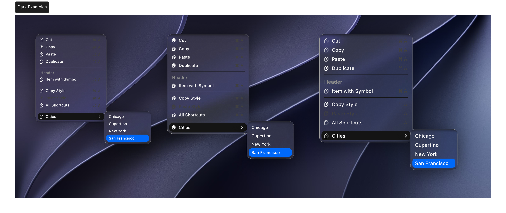
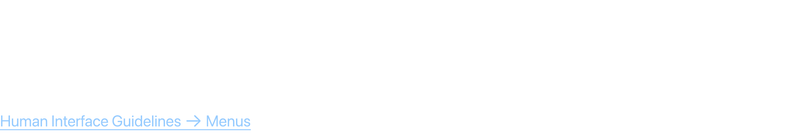
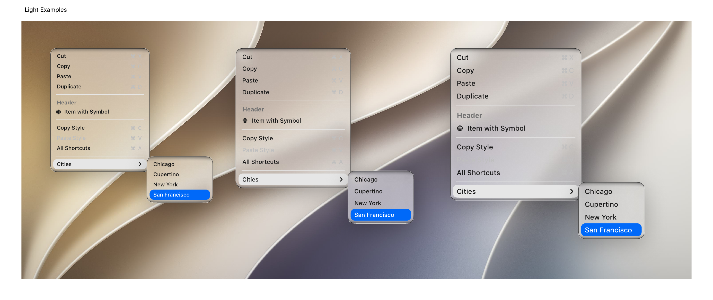
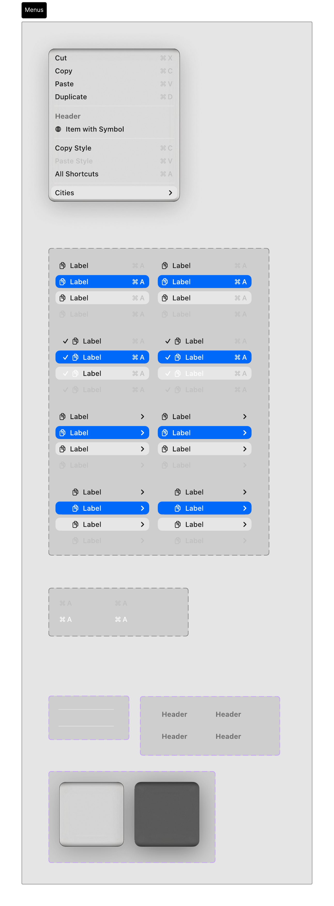

# Menus

Menus present a list of commands, actions, or states that users can choose from. They include context menus, app menus, and submenu panels.

## Official Apple HIG Guidelines & Resources

- [Menus](https://developer.apple.com/design/human-interface-guidelines/menus)

## Key Design Rules & Constraints

- Organize menu items logically, putting the most frequently used commands at the top.
- Group related options together using horizontal separators.
- Include keyboard shortcuts next to menu commands for power-user efficiency.
- Disable menu items that are not applicable in the current context rather than hiding them.

## Figma Component Specifications

These specifications are extracted from the local design PDFs inside this folder:

### Dark Examples.pdf

**Labels and Text elements:**

- `􀆔`
- `􀆔 C`
- `􀆔`
- `􀆔 D`
- `Header`
- `It em with Symbol`
- `􀆔 C`
- `􀆔`
- `􀆔 A`
- `Cities 􀆊`
- `Cut`
- `Cop y`
- `P as t e`
- `Duplicat e`
- `Cop y Style`
- *...and 153 more text elements.*

### Header.pdf

**Labels and Text elements:**

- `M e n u s`
- `A menu r e v eals its options when people int er act with it,  making it a space-efficient w ay t o pr esent commands in y our app`
- `or game.`
- `Human Int erf ace Guidelines 􀄫 Menus`

### Light Examples.pdf

**Labels and Text elements:**

- `􀆔 X`
- `􀆔 C`
- `􀆔 V`
- `􀆔 D`
- `Header`
- `􀆪 It em with Symbol`
- `􀆔 C`
- `􀆔 V`
- `􀆔 A`
- `Cities 􀆊`
- `Cut`
- `Cop y`
- `P as t e`
- `Duplicat e`
- `Cop y Style`
- *...and 153 more text elements.*

### Menus.pdf

**Labels and Text elements:**

- `Menus`
- `􀆔 X`
- `􀆔 C`
- `􀆔 V`
- `􀆔 D`
- `Header`
- `􀆪 It em with Symbol`
- `􀆔 C`
- `􀆔 V`
- `􀆔 A`
- `Cities 􀆊`
- `Cut`
- `Cop y`
- `P as t e`
- `Duplicat e`
- *...and 153 more text elements.*

## Visual Design Gallery (Screenshots)

Below are the rendered pages from the design component PDFs:

### Dark Examples 1

### Header 1

### Light Examples 1

### Menus 1

