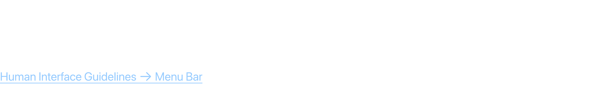

# Desktop Templates & Menu Bar

The menu bar spans the top of the screen in macOS, housing the Apple menu, app-specific menus, status items, and system search/control indicators.

## Official Apple HIG Guidelines & Resources

- [The Menu Bar](https://developer.apple.com/design/human-interface-guidelines/the-menu-bar)

## Key Design Rules & Constraints

- Ensure app menus are consistent with standard macOS menus (File, Edit, View, Window, Help).
- Status items in the menu bar must use simple, recognizable icons that adapt to dark/light wallpapers.
- Minimize status menu item clutter and allow users to hide status items.
- Design desktop templates to respect the menu bar height and safe margins.

## Figma Component Specifications

These specifications are extracted from the local design PDFs inside this folder:

### Desktop Templates.pdf

**Labels and Text elements:**

- `Deskt op T emplat es`
- `􀣺 Finder File Edit Vie w It em Windo w Help 􀊫 W ed Apr 1 9 :4 1 AM 􀣺 Finder File Edit Vie w It em Windo w Help 􀊫 W ed Apr 1 9 :4 1 AM`
- `􀣺`
- `􀣺`
- `App Name`
- `App Name`
- `File`
- `File`
- `Edit`
- `Edit`
- `Vie w`
- `Vie w`
- `It em`
- `It em`
- `Windo w`
- *...and 21 more text elements.*

### Header.pdf

**Labels and Text elements:**

- `M e n u  B a r  a n d  D o c k`
- `On a M ac or an iP ad,  the menu bar at the t op of the scr een displays the t op-le v el menus in y our app or game.`
- `Human Int erf ace Guidelines 􀄫 Menu Bar`

## Visual Design Gallery (Screenshots)

Below are the rendered pages from the design component PDFs:

### Desktop Templates 1

### Header 1

