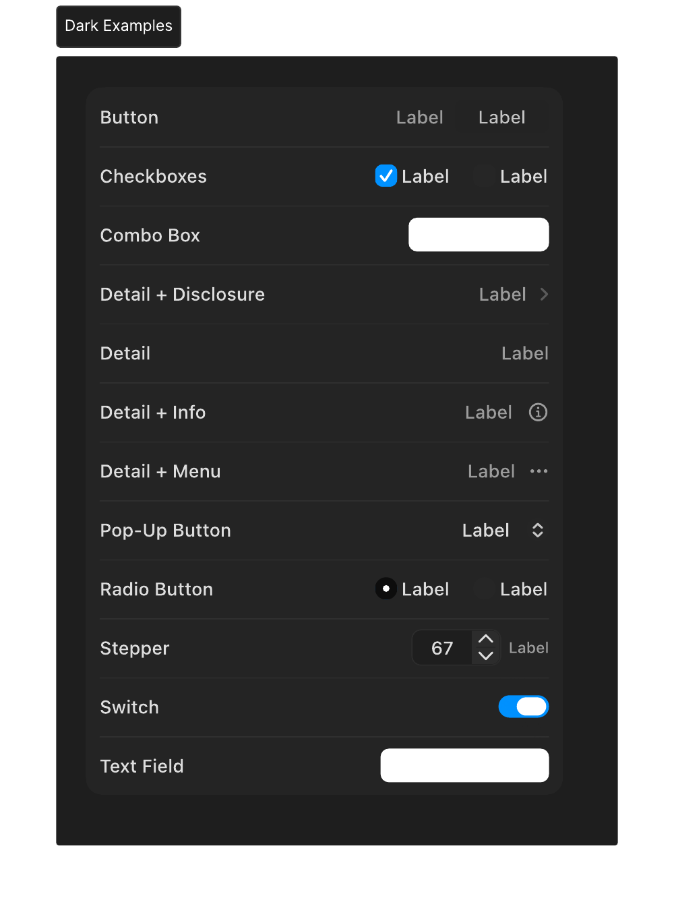
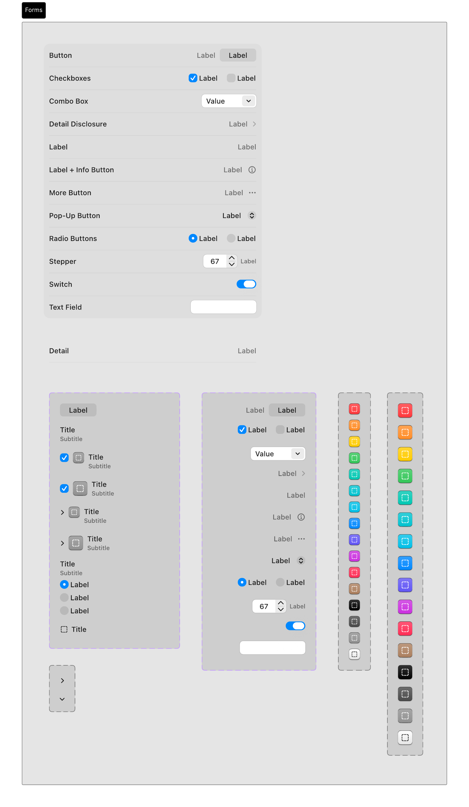
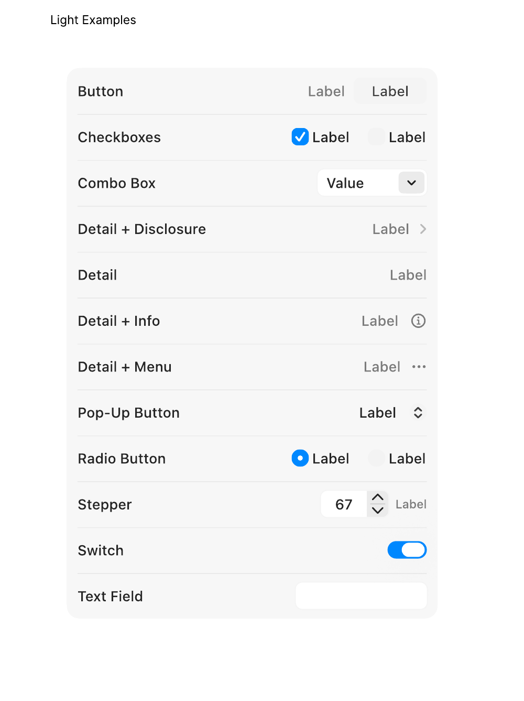

# Forms & Inputs

Forms and text inputs allow users to input data, configure parameters, and search for content within an application.

## Official Apple HIG Guidelines & Resources

- [Selection And Input](https://developer.apple.com/design/human-interface-guidelines/selection-and-input)

## Key Design Rules & Constraints

- Clearly label all input fields and place labels consistently (typically left-aligned or top-aligned to the input field).
- Use placeholder text for examples of expected input format, never as a replacement for labels.
- Provide real-time validation feedback (e.g., error indicators, password strength) for user reassurance.
- Ensure inputs support standard focus rings and keyboard navigation (Tab to move, Return to submit).

## Figma Component Specifications

These specifications are extracted from the local design PDFs inside this folder:

### Dark Examples.pdf

**Labels and Text elements:**

- `But t on`
- `Checkbo x es`
- `Combo Bo x`
- `Detail Disclosur e`
- `Label`
- `Label + Inf o But t on`
- `Mor e But t on`
- `P op-Up But t on`
- `Radio But t ons`
- `St epper`
- `Swit ch`
- `T e xt Field`
- `Label Label`
- `Label Label`
- `V alue 􀆈`
- *...and 84 more text elements.*

### Forms.pdf

**Labels and Text elements:**

- `F orms`
- `But t on`
- `Checkbo x es`
- `Combo Bo x`
- `Detail Disclosur e`
- `Label`
- `Label + Inf o But t on`
- `Mor e But t on`
- `P op-Up But t on`
- `Radio But t ons`
- `St epper`
- `Swit ch`
- `T e xt Field`
- `Label Label`
- `Label Label`
- *...and 118 more text elements.*

### Header.pdf

**Labels and Text elements:**

- `Forms`

### Light Examples.pdf

**Labels and Text elements:**

- `But t on`
- `Checkbo x es`
- `Combo Bo x`
- `Detail Disclosur e`
- `Label`
- `Label + Inf o But t on`
- `Mor e But t on`
- `P op-Up But t on`
- `Radio But t ons`
- `St epper`
- `Swit ch`
- `T e xt Field`
- `Label Label`
- `Label Label`
- `V alue 􀆈`
- *...and 84 more text elements.*

## Visual Design Gallery (Screenshots)

Below are the rendered pages from the design component PDFs:

### Dark Examples 1

### Forms 1

### Header 1

### Light Examples 1

