# Buttons

Buttons trigger app-specific actions, open menus, or close dialogs. macOS buttons include push buttons, segmented buttons, and disclosure controls.

## Official Apple HIG Guidelines & Resources

- [Buttons](https://developer.apple.com/design/human-interface-guidelines/buttons)

## Key Design Rules & Constraints

- Use standard button shapes and sizes (e.g., rounded rectangle for push buttons).
- Style the primary action button with a solid colored background (accent color) and secondary buttons with borderless or light outlines.
- Place dismissal and confirmation buttons consistently (e.g., Cancel on the left, OK/Save on the right in dialogs).
- Clearly label buttons with active verbs describing the action (e.g., 'Save', 'Delete', 'Add Project').

## Figma Component Specifications

These specifications are extracted from the local design PDFs inside this folder:

### Buttons - Arrow Buttons.pdf

**Labels and Text elements:**

- `Buttons - Arrow Buttons`
- `􀆏`
- `􀆏`
- `􀆏`
- `􀆏`
- `􀆏`
- `􀆏`
- `􀆏`
- `􀆏`
- `􀆏`
- `􀆏`
- `􀆏`
- `􀆏`
- `􀆏`
- `􀆏`
- *...and 19 more text elements.*

### Buttons - Toggle.pdf

**Labels and Text elements:**

- `Label`
- `Label`
- `Label`
- `Label`
- `Label`
- `Label`
- `Label`
- `Label`
- `Label`
- `Label`
- `Label`
- `Label`
- `Label`
- `Label`
- `Label`
- *...and 9 more text elements.*

### Buttons.pdf

**Labels and Text elements:**

- `Label`
- `Label`
- `Label`
- `Label`
- `Label`
- `Label`
- `Label`
- `Label`
- `Label`
- `Label`
- `Label`
- `Label`
- `Label`
- `Label`
- `Label`
- *...and 57 more text elements.*

### Dark Examples.pdf

**Labels and Text elements:**

- `􀆏`
- `􀆏`
- `􀆏`
- `􀆏`
- `􀆏`
- `􀆏`
- `􀆏`
- `􀆏`
- `􀆏`
- `􀆏`
- `􀆏`
- `􀆏`
- `􀆏`
- `􀆏`
- `􀆏`
- *...and 19 more text elements.*

### Examples - Dark, Content Area.pdf

**Labels and Text elements:**

- `Label`
- `Label`
- `Label`
- `Label`
- `Label`
- `Label`
- `Label`
- `Label`
- `Label`
- `Label`
- `Label`
- `Label`
- `Label`
- `Label`
- `Label`
- *...and 328 more text elements.*

### Examples - Dark, Over Glass.pdf

**Labels and Text elements:**

- `Label`
- `Label`
- `Label`
- `Label`
- `Label`
- `Label`
- `Label`
- `Label`
- `Label`
- `Label`
- `Label`
- `Label`
- `Label`
- `Label`
- `Label`
- *...and 328 more text elements.*

### Examples - Light, Content Area.pdf

**Labels and Text elements:**

- `Label`
- `Label`
- `Label`
- `Label`
- `Label`
- `Label`
- `Label`
- `Label`
- `Label`
- `Label`
- `Label`
- `Label`
- `Label`
- `Label`
- `Label`
- *...and 328 more text elements.*

### Examples - Light, Over Glass.pdf

**Labels and Text elements:**

- `Label`
- `Label`
- `Label`
- `Label`
- `Label`
- `Label`
- `Label`
- `Label`
- `Label`
- `Label`
- `Label`
- `Label`
- `Label`
- `Label`
- `Label`
- *...and 328 more text elements.*

### Header.pdf

**Labels and Text elements:**

- `B u t t o n s`
- `A butt on initiat es an inst ant aneous action.`
- `Human Int erf ace Guidelines 􀄫 Butt ons`

### Light Examples.pdf

**Labels and Text elements:**

- `􀆏`
- `􀆏`
- `􀆏`
- `Light Examples`
- `􀆏`
- `􀆏`
- `􀆏`
- `􀆏`
- `􀆏`
- `􀆏`
- `􀆏`
- `􀆏`
- `􀆏`
- `􀆏`
- `􀆏`
- *...and 19 more text elements.*

### _Label.pdf

**Labels and Text elements:**

- `Label Label`
- `Label Label`
- `Label Label`
- `Label Label`
- `Label Label`
- `Label Label`

### _Labels - Borderless.pdf

**Labels and Text elements:**

- `Label Label`
- `Label Label`
- `Label Label`
- `Label Label`
- `Label Label`
- `Label Label`

### _Labels - Destructive.pdf

**Labels and Text elements:**

- `Label Label`
- `Label Label`
- `Label Label`
- `Label Label`
- `Label Label`
- `Label Label`

### _Labels - Preferred.pdf

**Labels and Text elements:**

- `Label Label`
- `Label Label`
- `Label Label`
- `Label Label`
- `Label Label`
- `Label Label`

### _Labels - Tinted.pdf

**Labels and Text elements:**

- `Label Label`
- `Label Label`
- `Label Label`
- `Label Label`
- `Label Label`
- `Label Label`

### _Labels - Toggle.pdf

**Labels and Text elements:**

- `Label Label`
- `Label Label`
- `Label Label`
- `Label Label`
- `Label Label`
- `Label Label`
- `Label Label`
- `Label Label`
- `Label Label`
- `Label Label`
- `Label Label`
- `Label Label`
- `Label Label`
- `Label Label`
- `Label Label`
- *...and 9 more text elements.*

## Visual Design Gallery (Screenshots)

Below are the rendered pages from the design component PDFs:

### Buttons 1
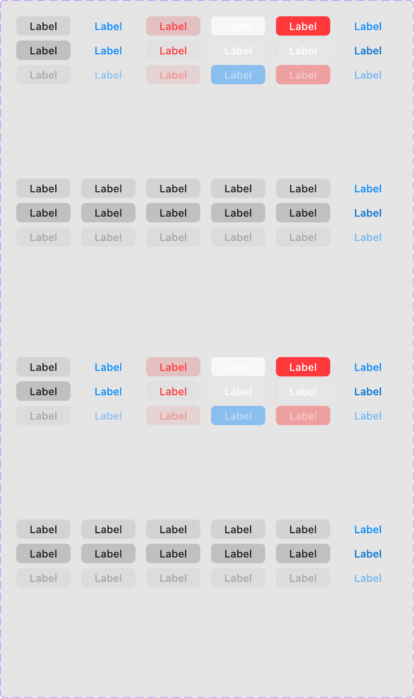

### Buttons   Arrow Buttons 1
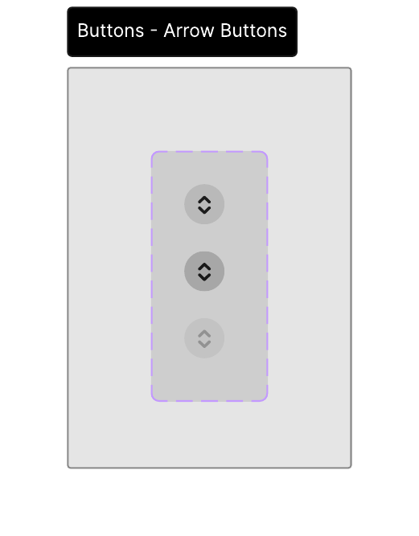

### Buttons   Toggle 1
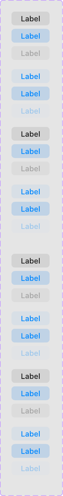

### Dark Examples 1
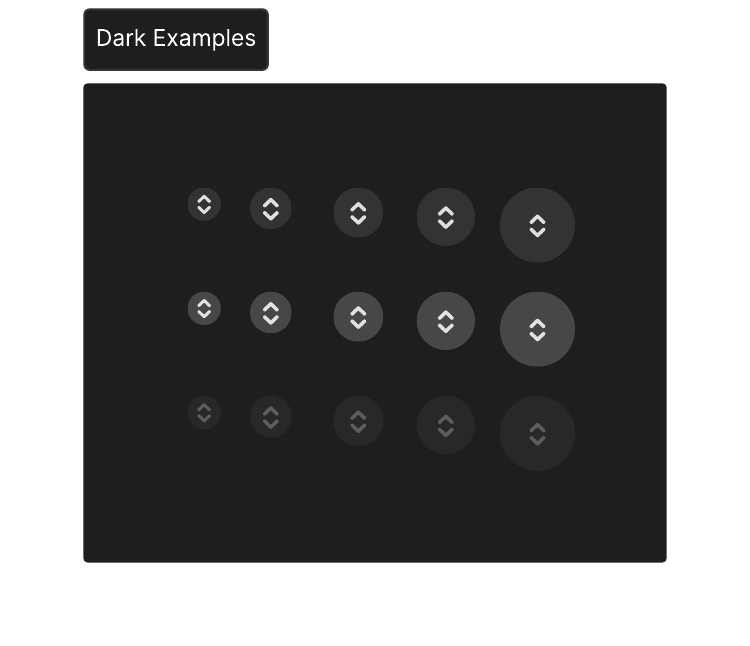

### Examples   Dark, Content Area 1
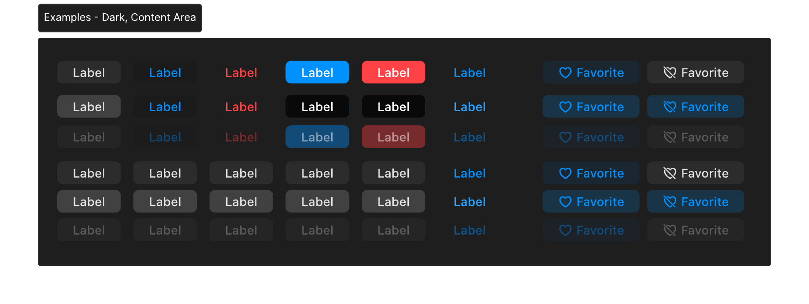

### Examples   Dark, Over Glass 1
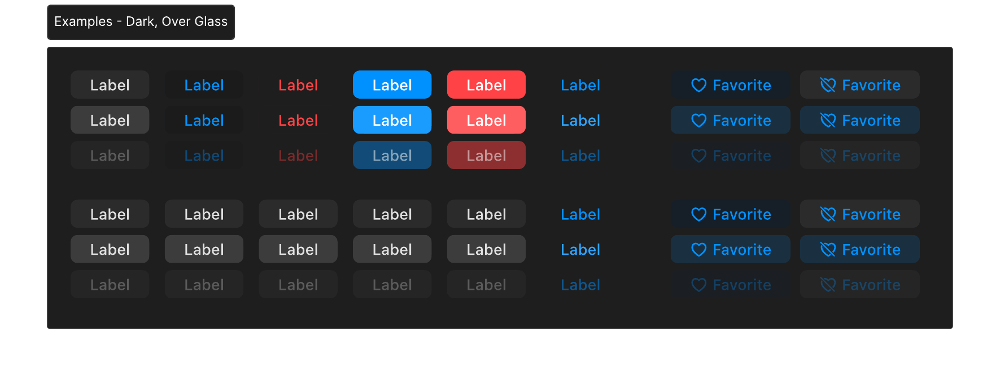

### Examples   Light, Content Area 1
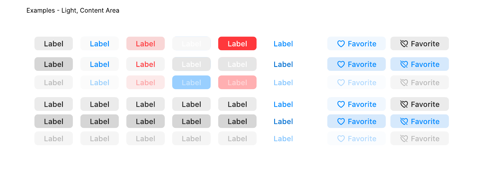

### Examples   Light, Over Glass 1
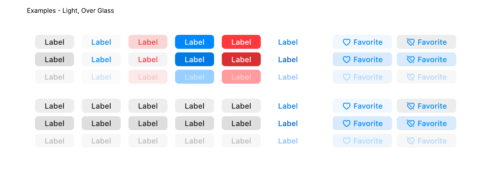

### Header 1
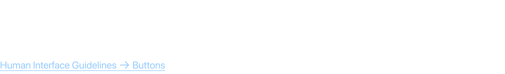

### Light Examples 1
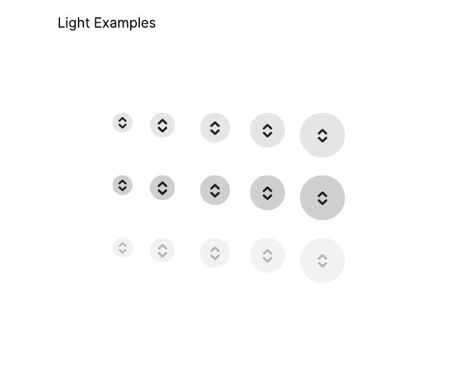

###  Label 1
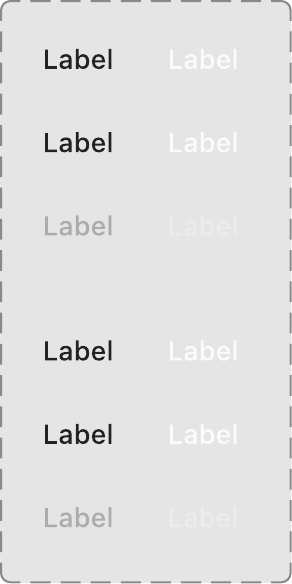

###  Labels   Borderless 1
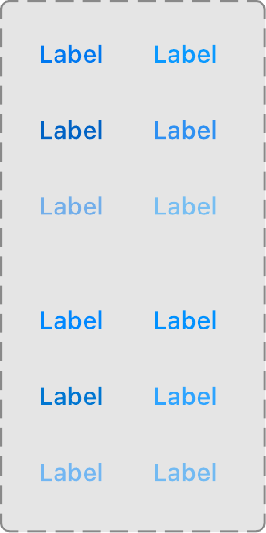

###  Labels   Destructive 1
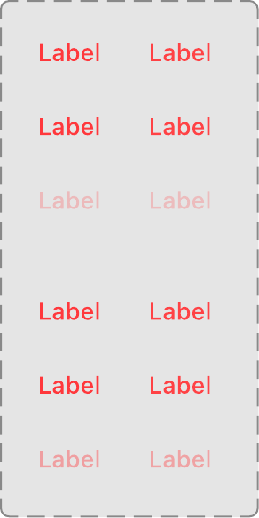

###  Labels   Preferred 1
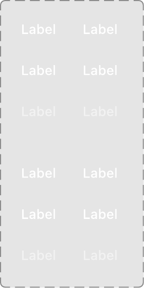

###  Labels   Tinted 1
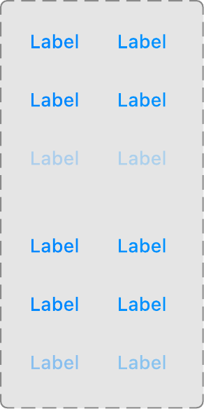

###  Labels   Toggle 1
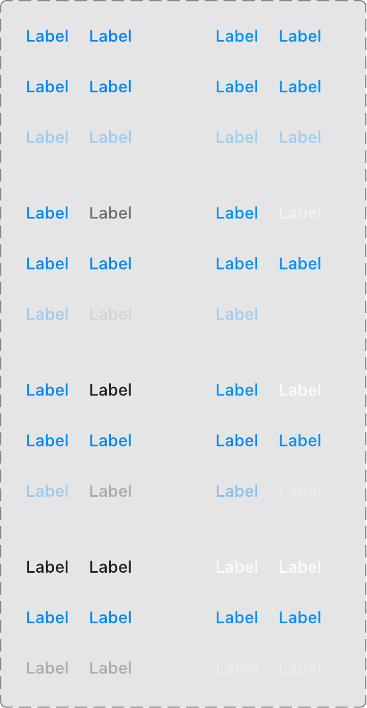
