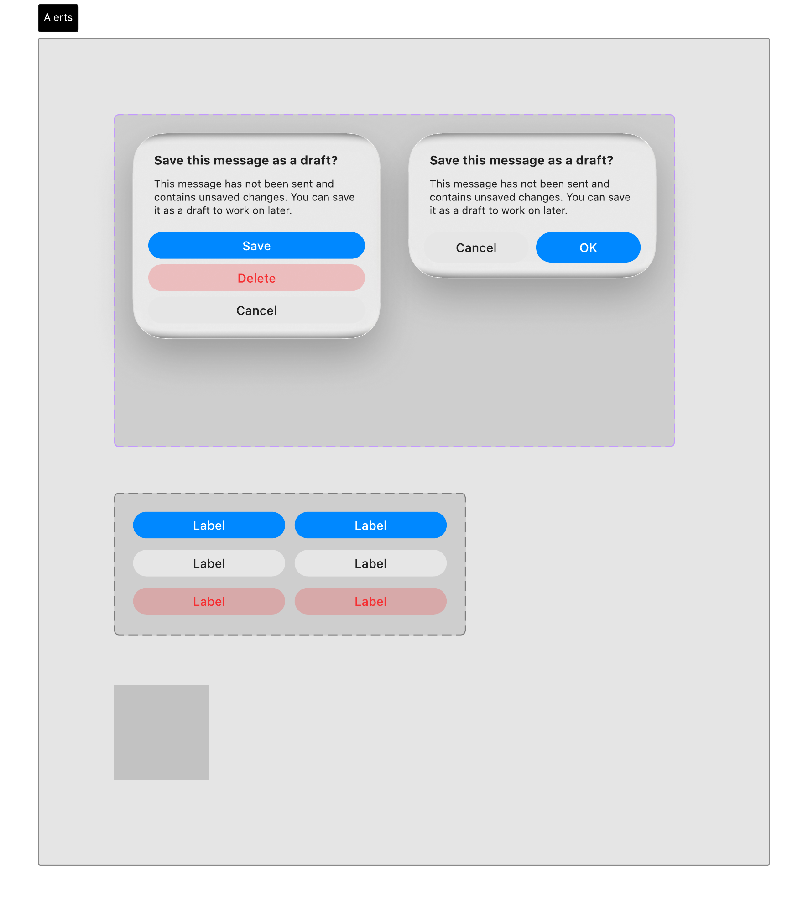
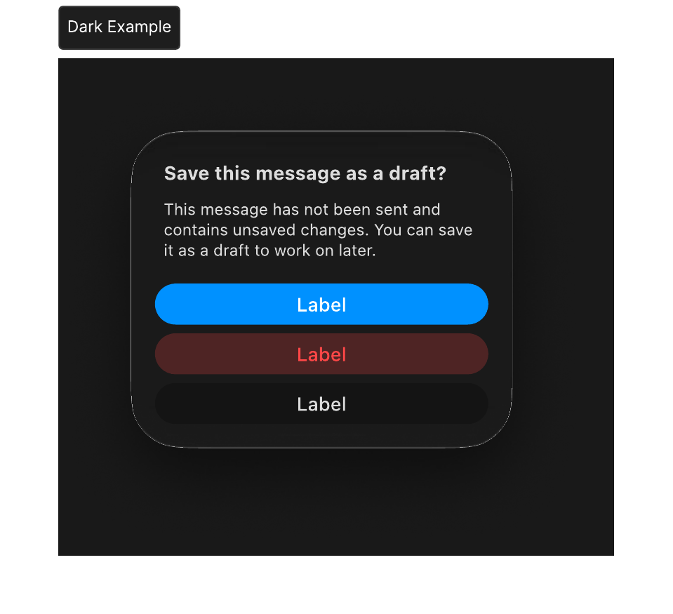
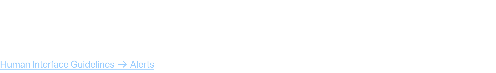
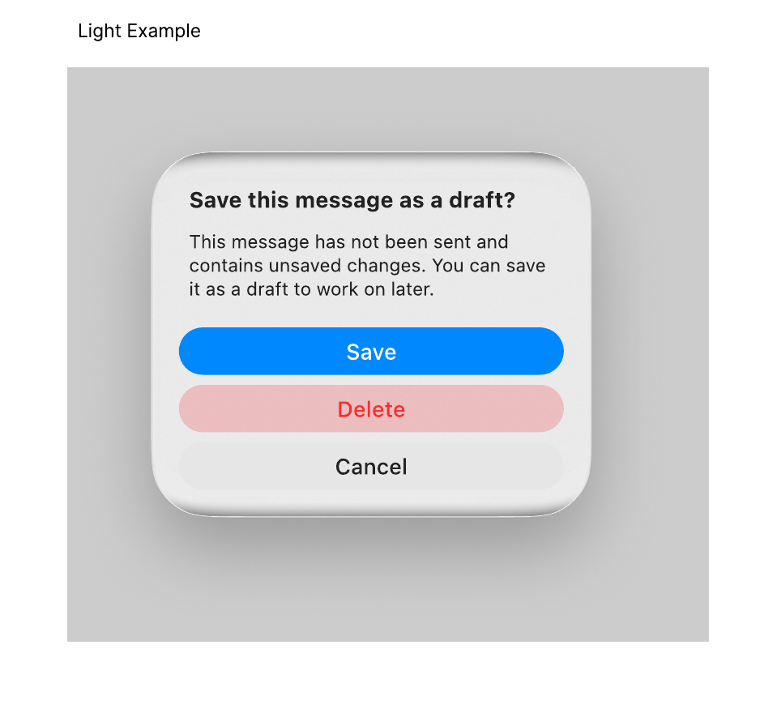

# Alerts

Alerts are modal notifications that require user attention and action before continuing. They are used for errors, warnings, or destructive actions.

## Official Apple HIG Guidelines & Resources

- [Alerts](https://developer.apple.com/design/human-interface-guidelines/alerts)

## Key Design Rules & Constraints

- Use alerts sparingly to avoid fatigue; they should only appear for critical choices or errors.
- Include a descriptive title (what happened) and an informative message (what the user can do).
- Provide clear, actionable button labels (e.g., 'Delete' instead of 'OK' for destructive steps).
- Always include a safe 'Cancel' action that does not execute the alert's operation.

## Figma Component Specifications

These specifications are extracted from the local design PDFs inside this folder:

### Alerts.pdf

**Labels and Text elements:**

- `Aler t s`
- `S a v e this mes sage as a dr af t?`
- `This mes sage has not been sent and`
- `contains unsa v ed changes. Y ou can sa v e`
- `it as a draft t o w ork on lat er .`
- `S a v e`
- `Delet e`
- `Cancel`
- `S a v e this mes sage as a dr af t?`
- `This mes sage has not been sent and`
- `contains unsa v ed changes. Y ou can sa v e`
- `it as a draft t o w ork on lat er .`
- `Cancel OK`
- `Label`
- `Label`
- *...and 18 more text elements.*

### Dark Example.pdf

**Labels and Text elements:**

- `S a v e this mes sage as a dr af t?`
- `This mes sage has not been sent and`
- `contains unsa v ed changes. Y ou can sa v e`
- `it as a draft t o w ork on lat er .`
- `a e`
- `ele e`
- `ael`
- `S a v e this mes sage as a dr af t?`
- `This mes sage has not been sent and`
- `contains unsa v ed changes. Y ou can sa v e`
- `it as a draft t o w ork on lat er .`
- `ael`
- `Label`
- `Label`
- `Label`
- *...and 18 more text elements.*

### Header.pdf

**Labels and Text elements:**

- `A l e r t s`
- `An aler t giv es people critical inf ormation the y need right aw ay .`
- `Human Int erf ace Guidelines 􀄫 Aler ts`

### Light Example.pdf

**Labels and Text elements:**

- `S a v e this mes sage as a dr af t?`
- `This mes sage has not been sent and`
- `contains unsa v ed changes. Y ou can sa v e`
- `it as a draft t o w ork on lat er .`
- `S a v e`
- `Delet e`
- `Cancel`
- `S a v e this mes sage as a dr af t?`
- `This mes sage has not been sent and`
- `contains unsa v ed changes. Y ou can sa v e`
- `it as a draft t o w ork on lat er .`
- `Cancel`
- `ael`
- `ael`
- `ael`
- *...and 18 more text elements.*

## Visual Design Gallery (Screenshots)

Below are the rendered pages from the design component PDFs:

### Alerts 1

### Dark Example 1

### Header 1

### Light Example 1

